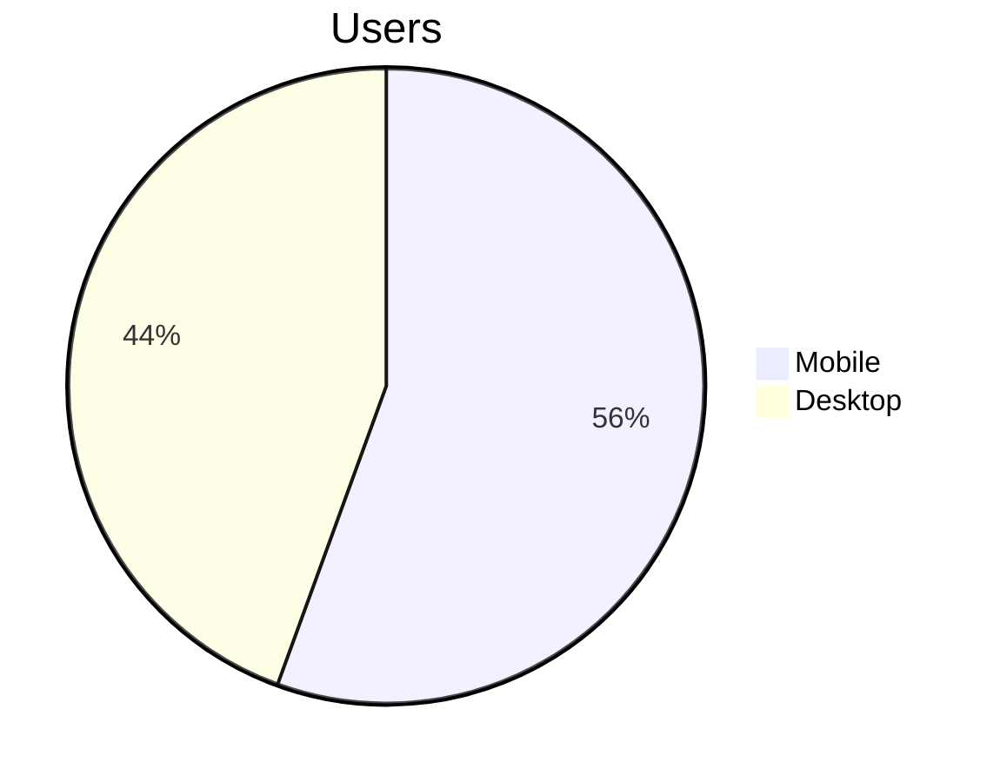
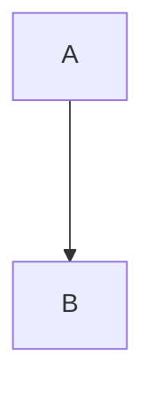
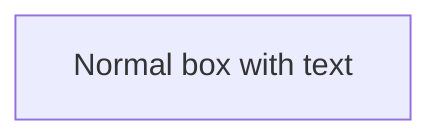
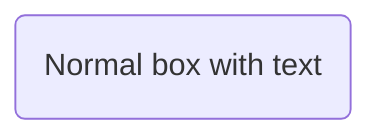
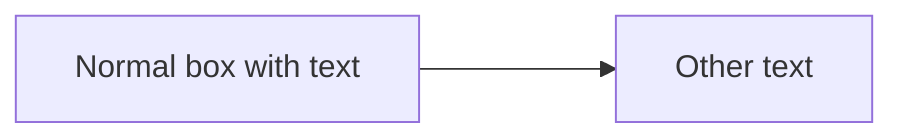

## Pie charts

```mermaid
pie title Users
"Mobile": 50
"Desktop": 40
```

## Graph

```mermaid
graph TD
A--->B
```

### Direction
- Top bottom `graph TD` or `graph TB`
- Bottom tp `graph BT`
- Left to right `graph LR`
- Right to Left tp `graph RL`

### Shapes 

```mermaid
graph TD

boxa[ Normal box with text ]
```

```mermaid
graph TD

boxa( Normal box with text )
```

```mermaid
graph TD

boxa([ Normal box with text ])
```

```mermaid
graph LR

boxa[ Normal box with text ] ---> boxb[Other text]
```

