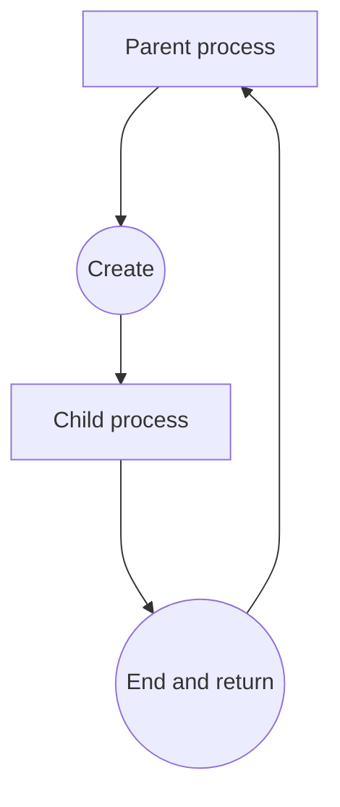

# Processes

**Process**: A program currently running on the system.

Process have a parent-child relationship, the parent process can create a child process, and the child process can create another child process. All the processes have a parent process, except for the *systemd* and *kthreadd* processes, which are the processes run by the scheduler at boot time. When the child process is done, it returns the result to the parent process and end.

Each process has a unique number, and they have types:
- *Daemon process*: It exists to provide certain services and is run by the Linux kernel
- *Orphan process*: The child process is still running, but the child process whose parent process exited first is an orphan process.
- *Zombie process*: A child process remains in the process table list even though it has terminated execution.


Command to see list of currently running processes: 

```shell
ps 
```

If you use the ps command without any options it prints information about user processes running in the current shell or terminal

Print detailed information of the process: PPID, terminal number, start time, etc.

```shell
ps -f 
```

Print information about the process running in the terminal

```shell
ps a 
```

If you use the a option and the u option together, the detailed information of the process executed in the terminal is printed: CPU and memory usage

```shell
ps au
```

Using the `-ef` option prints more detailed information about the entire process

```shell
ps -ef
```

Print all processes running on the system

```shell
ps ax
```

The aux option like `-ef`, prints detailed information about all running processes on the system.

```shell
ps aux
```

Print a list of processes for a specific user.

```shell
ps -u user1
```

If a specific PID is specified with the -p option, information of that process is printed

```shell
ps -p 4882
```

Concatenate `ps` and `grep` commands with `|` to retrieve information about a specific process

```shell
ps -ef | grep bash
```

## Retrieving specific process

`pgrep` looks through the currently running process and lists the process IDs which matches the selection criteria to stdout. All the criteria have to match. For example, `pgrep -u root sshd` will only list the processes called *sshd* and owned by root.

Options :  
- *d* delimiter Sets the string used to delimit each process ID in the output (by default a newline). (pgrep only.)  
- *f* The pattern is normally only matched against the process name. When -f is set, the full command line is used.  
- *g* Only match processes in the process group IDs listed. Process group 0 is translated into pgrep's or pkill's own process group. -G Only match processes whose real group ID is listed. Either the numerical or symbolical value may be used.  
- *l* List the process name as well as the process ID. (pgrep only.)  
- *n* Select only the newest (most recently started) of the matching processes.  
- *o* Select only the oldest (least recently started) of the matching processes.  
- *P* Only match processes whose parent process ID is listed.  
- *x* Only match processes whose name (or command line if -f is specified) exactly match the pattern.

```shell
pgrep -x bash
```

We can use the `pgrep` command in conjunction with the `ps` command to retrieve more detailed information

```shell
ps -fp $(pgrep -x bash)
```

Search by specifying user name with the -u option

```shell
ps -fp $(pgrep -u ram bash)
```

